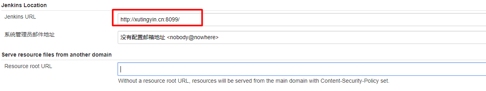
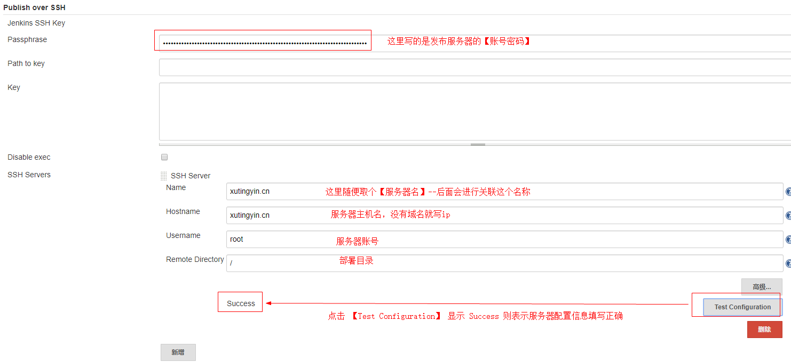
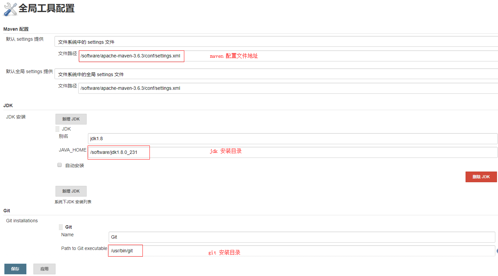
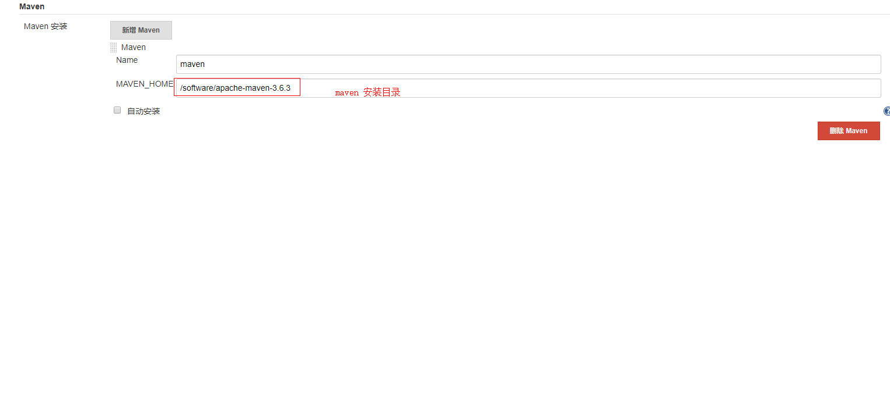
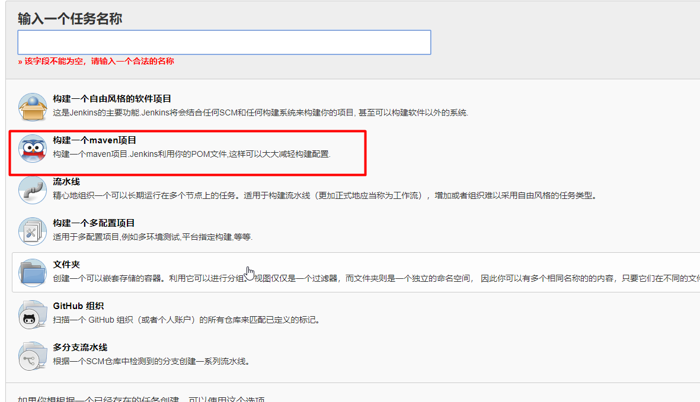
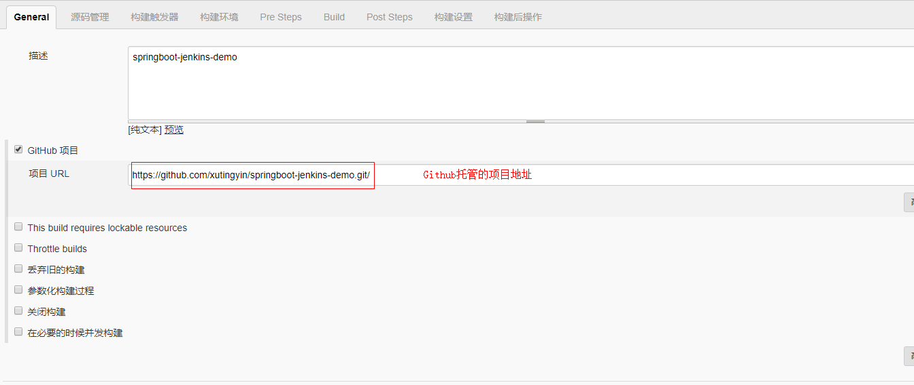
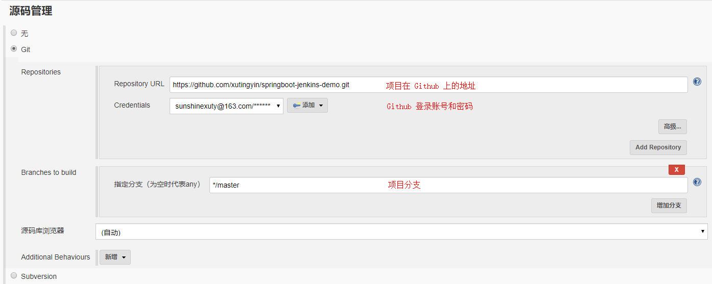
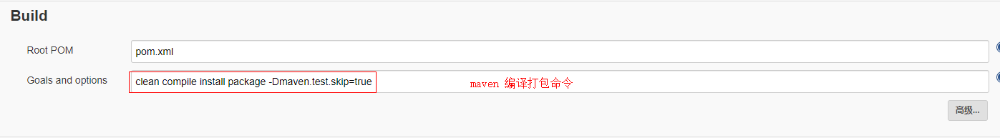
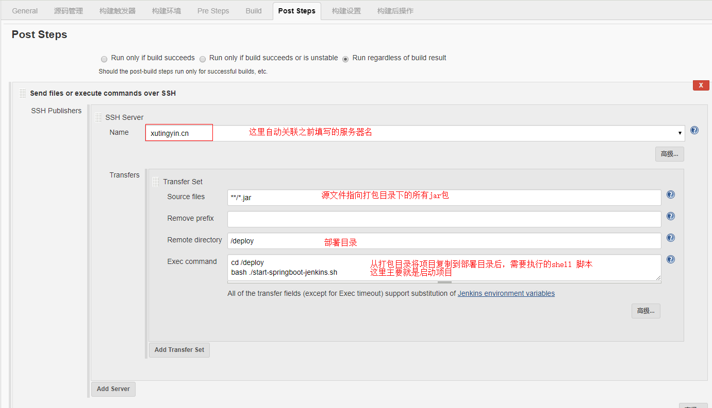
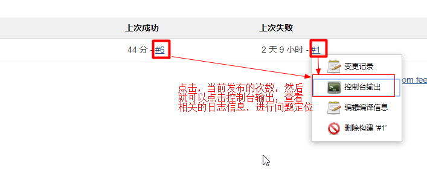

# springboot-jenkins-demo
springboot-jenkins 学习使用demo

这里涉及几个重要的步骤：
## 一、Jenkins的安装
1、war包直接启动

2、需要使用的插件安装
	
①Maven Integration plugin

②Publish Over SSH

## 二、springboot-demo 编写
新建一个springboot 项目，编写一个HelloController ,进行当前时间的输出

## 三、Jenkins 获取 springboot-demo 源码 [托管在Github],一键部署到服务器

详细配置步骤：

1、Jenkins系统配置

2、Jenkins 全局工具配置

3、Jenkins 创建一个maven 项目

配置一系列相关信息：

最后，保存设置。回到主界面，一键构建部署就OK了。

如果没有成功，我们可以根据Jenkins控制台进行错误日志的查看，进行问题定位。

这里给出，日志查看位置，刚开始，自己找了半天都没找到：

其中遇到两个问问题：
1、部署脚本存在问题，死活启动不了[这里纠结了两天，终于弄好了]

后来发现，脚本写的有问题，改为绝对路径可以解决一些不必要的麻烦

2、Jenkins 控制台，中文乱码问题

注：这个只是自己在windows 环境下测试jenkins时出现这个问题，将jenkins 部署到linux 环境没有此问题

解决方案：

增加系统环境变量：
JAVA_TOOL_OPTIONS
变量值为：-Dfile.encoding=UTF-8